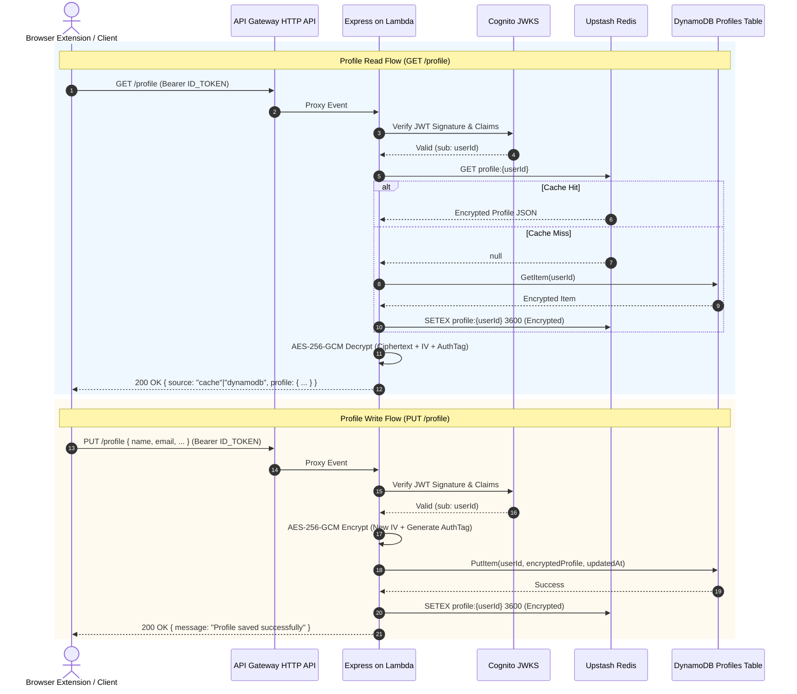
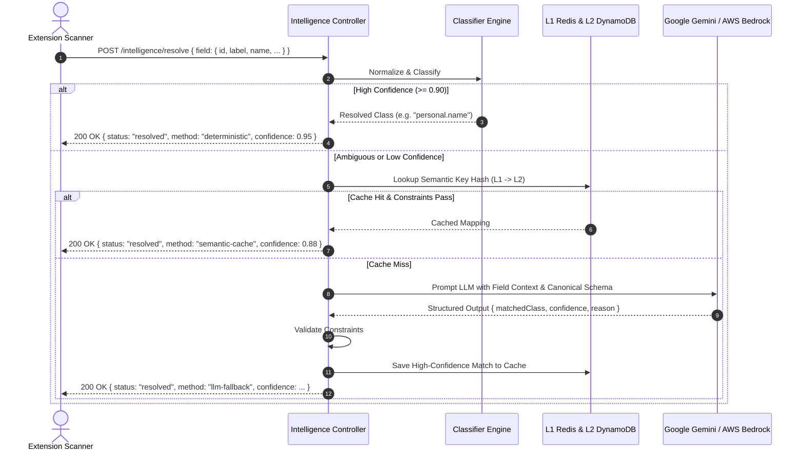

# FormFriend — Backend Architecture & Service Documentation

Cloud backend for the **FormFriend** hybrid browser autofill ecosystem.  
Built for privacy-first autofill, zero-knowledge encrypted profile synchronization, sub-millisecond retrieval caching, and a multi-tiered semantic field resolution engine powered by deterministic classification, distributed caching, and AI fallback models.

---

## Table of Contents

1. [System Architecture Overview](#system-architecture-overview)
2. [Core Backend Architectural Pillars](#core-backend-architectural-pillars)
   - [1. Authentication & Identity Isolation (AWS Cognito)](#1-authentication--identity-isolation-aws-cognito)
   - [2. Zero-Knowledge Encrypted Storage (DynamoDB Profiles)](#2-zero-knowledge-encrypted-storage-dynamodb-profiles)
   - [3. High-Speed Distributed Caching (Upstash Redis)](#3-high-speed-distributed-caching-upstash-redis)
   - [4. Multi-Tier Form Intelligence Engine](#4-multi-tier-form-intelligence-engine)
   - [5. Serverless Infrastructure (AWS SAM & Lambda)](#5-serverless-infrastructure-aws-sam--lambda)
3. [End-to-End Data Flow Diagrams](#end-to-end-data-flow-diagrams)
   - [Profile Read/Write Flow](#profile-readwrite-flow)
   - [Form Field Intelligence Resolution Flow](#form-field-intelligence-resolution-flow)
4. [Database & Schema Designs](#database--schema-designs)
5. [Repository Structure](#repository-structure)
6. [API Specification](#api-specification)
7. [Local Development Setup](#local-development-setup)
8. [Production Deployment Guide (AWS SAM)](#production-deployment-guide-aws-sam)
9. [Security, Encryption & Privacy Principles](#security-encryption--privacy-principles)

---

## System Architecture Overview

FormFriend adopts a **serverless-first, hybrid cloud architecture** designed to run identically in both local Node.js development environments and enterprise AWS production environments.

```
                     ┌─────────────────────────────────────────────────────────┐
                     │          Client Applications / Consumers                │
                     │  (Browser Extension, Postman, Web Crypto Vault Client)  │
                     └────────────────────────────┬────────────────────────────┘
                                                  │ HTTPS / JSON
                                                  ▼
                     ┌─────────────────────────────────────────────────────────┐
                     │            Ingress & Routing Layer                      │
                     │       Amazon API Gateway HTTP API ($default stage)      │
                     │                 (or Express.js locally)                 │
                     └────────────────────────────┬────────────────────────────┘
                                                  │
                                                  ▼
                     ┌─────────────────────────────────────────────────────────┐
                     │           Serverless Application Layer                  │
                     │       AWS Lambda (Node.js 20.x Runtime)                 │
                     │   ┌─────────────────────────────────────────────────┐   │
                     │   │ Express App (`serverless-http` wrapper)         │   │
                     │   │  ├─ Auth Middleware (Cognito JWT Verification)  │   │
                     │   │  ├─ Auth Controller                             │   │
                     │   │  ├─ Profile Controller (AES-256-GCM Encryption) │   │
                     │   │  └─ Intelligence Controller                     │   │
                     │   └─────────────────────────────────────────────────┘   │
                     └───────┬──────────────┬──────────────┬─────────────┬─────┘
                             │              │              │             │
              ┌──────────────┘              │              │             └──────────────┐
              ▼                             ▼              ▼                            ▼
   ┌────────────────────┐         ┌────────────────┐ ┌────────────────┐       ┌────────────────────┐
   │ Identity Provider  │         │ Hot L1/L2 Cache│ │ Primary Store  │       │ Semantic & AI Tier │
   │   AWS Cognito      │         │ Upstash Redis  │ │ Amazon DynamoDB│       │                    │
   │  User Pool & Auth  │         │ (REST Engine)  │ │  (Profiles &   │       │ ├─ Semantic Cache  │
   │                    │         │                │ │Semantic Cache) │       │ ├─ Google Gemini   │
   │ - SRP Authentication│        │ - Profile TTL  │ │                │       │ └─ AWS Bedrock     │
   │ - JWT Issuance     │         │ - L1 Semantics │ │ - Pay-per-req  │       │    (Embeddings)    │
   │ - Email Verify     │         │ - Live Metrics │ │ - GSI Indexes  │       │                    │
   └────────────────────┘         └────────────────┘ └────────────────┘       └────────────────────┘
```

---

## Core Backend Architectural Pillars

### 1. Authentication & Identity Isolation (AWS Cognito)

The authentication system is built on **Amazon Cognito User Pools** with client-side user verification and stateless JWT authorization:

- **Decoupled User Identity**: User credentials, salts, and password hashes are handled exclusively by AWS Cognito (`ALLOW_USER_PASSWORD_AUTH`). No passwords or plaintext hashes ever touch the application database.
- **Stateless JWT Verification**: Incoming requests to protected routes pass through `src/middleware/auth.middleware.js`, which validates RSA-signed ID tokens via `aws-jwt-verify` against the Cognito JWKS endpoint.
- **Zero-Trust Identity Mapping**: The backend extracts the user's permanent identifier strictly from the verified JWT `sub` claim. Clients cannot spoof `userId` parameters through payload tampering or URL parameters.

---

### 2. Zero-Knowledge Encrypted Storage (DynamoDB Profiles)

User profiles contain sensitive identity and form data. FormFriend protects this data using authenticated envelope encryption:

- **AES-256-GCM Cryptography**:
  - Each profile is serialized to JSON and encrypted using an **AES-256-GCM** cipher (`src/services/encryption.service.js`).
  - An initialization vector (IV, 12 bytes / 16 chars) is uniquely generated per write operation using `crypto.randomBytes()`.
  - A 16-byte authentication tag (`authTag`) ensures cryptographic ciphertext integrity. Any tampering causes decryption rejection.
- **Data at Rest Schema**:
  The DynamoDB `Profiles` table never stores plaintext field names or sensitive values:
  ```json
  {
    "userId": "91635d2a-9071-7017-f7e2-0028fcfb247d",
    "encryptedProfile": {
      "ciphertext": "oF8pBwEMZSyOEoqrmhCqmqxkLiEQ...",
      "iv": "n5E0VFA2egYvFovM",
      "authTag": "J1b5rqRkLMsyggkjaYxsmg==",
      "algorithm": "aes-256-gcm",
      "version": 1
    },
    "schemaVersion": 1,
    "updatedAt": "2026-09-20T14:11:30.951Z"
  }
  ```

---

### 3. High-Speed Distributed Caching (Upstash Redis)

FormFriend uses **Upstash Serverless Redis** over HTTP REST to provide predictable sub-millisecond retrieval without maintaining persistent TCP connection pools inside short-lived Lambda instances:

- **Encrypted Profile Cache**:
  - Key: `profile:{userId}`
  - The profile is cached in its **encrypted** format. Plaintext profiles are never placed into Redis, ensuring memory dumps or access logs remain confidential.
  - Expiry: Configurable time-to-live (`REDIS_PROFILE_TTL_SECONDS`, default: 3600 seconds).
- **Cache-Aside & Write-Through Strategy**:
  - **Read (`GET /profile`)**: Checks Redis first (`source: "cache"`). On a cache miss, queries DynamoDB (`source: "dynamodb"`), decrypts the payload for the client, and concurrently repopulates Redis.
  - **Write (`PUT /profile`)**: Persists the newly encrypted payload to DynamoDB first, then updates the Redis key atomically to prevent cache drift.

---

### 4. Multi-Tier Form Intelligence Engine

The intelligence pipeline (`src/intelligence/intelligence.service.js`) solves the problem of mapping arbitrary web form inputs to standard canonical profile attributes (e.g. mapping `txt_applicant_first_name` or `Candidate Name` to `personal.name`).

```
                          Incoming Field Context
                       (id, name, label, type, etc.)
                                    │
                                    ▼
                         [ 1. Field Normalizer ]
                       (cleanup, lowercasing, n-grams)
                                    │
                                    ▼
                     [ 2. Deterministic Classifier ]
                     (regex & keyword canonical schema)
                                    │
                       Confidence >= 0.90?
                             /             \
                          YES               NO
                          /                   \
                         ▼                     ▼
             [ Instant Resolution ]  [ 3. Semantic Key Generation ]
                                     (SHA-256 signature hash)
                                               │
                                               ▼
                                  [ 4. Redis Hot Cache (L1) ]
                                               │
                                             Hit?
                                            /    \
                                          YES     NO
                                          /         \
                                         ▼           ▼
                           [ Validate Constraints ]  [ 5. DynamoDB Semantic Cache (L2) ]
                                         │           (Indexed by SemanticKeyIndex)
                                         │                       │
                                         │                     Hit?
                                         │                    /    \
                                         │                  YES     NO
                                         │                  /         \
                                         │                 ▼           ▼
                                         │       [ Hydrate L1 Cache ] [ 6. AI Fallback Tier ]
                                         │                 │          (Gemini / Bedrock)
                                         │                 │                   │
                                         ▼                 ▼                   ▼
                                ┌────────────────────────────────────────────────┐
                                │             Constraint Verification            │
                                │   (Input type, length, regex validation)       │
                                └───────────────────────┬────────────────────────┘
                                                        │
                                                        ▼
                                ┌────────────────────────────────────────────────┐
                                │         Autonomous Feedback Reinforcement      │
                                │  High confidence mappings stored in L1 & L2    │
                                └────────────────────────────────────────────────┘
```

#### Pipeline Stages:

1. **Field Normalization (`fieldNormalizer.js`)**:
   Standardizes input attributes by stripping noise, parsing HTML tag signatures, decomposing compound labels, and extracting core candidate tokens.
2. **Deterministic Classifier (`deterministicClassifier.js`)**:
   Evaluates inputs against a curated set of high-confidence patterns and schema classes (`schemas/exam-profile-schema.json`). If classification confidence is $\ge 0.90$, it resolves immediately with zero database lookups.
3. **Semantic Key & Fingerprinting (`semanticKey.js`)**:
   Generates a normalized semantic fingerprint and a SHA-256 hash representing the field's structural and semantic identity.
4. **L1 Redis Hot Cache (`semanticCache.service.js`)**:
   Checks in-memory Redis for pre-resolved field mappings with immediate return on hit.
5. **L2 DynamoDB Semantic Cache**:
   Queries the `FormSemanticCache` table using the `SemanticKeyIndex` GSI. If found, the result is served and promoted to the L1 Redis hot cache.
6. **Constraint Checker (`constraintChecker.js`)**:
   Guarantees that proposed field mappings adhere to data type rules (e.g. preventing an email field from mapping to a date picker or integer).
7. **AI & LLM Fallback (`llm.service.js`)**:
   For complex, obfuscated, or multilingual fields, queries **Google Gemini** (`gemini-3.5-flash-lite` or `gemini-2.5-flash-lite`) or **AWS Bedrock** (`amazon.titan-embed-text-v1`).
8. **Self-Learning & Continuous Reinforcement**:
   High-confidence LLM classifications ($\ge 0.85$) are automatically saved into the semantic cache. When users accept an autofill match, the browser extension calls `/intelligence/feedback`, incrementing the mapping's `validatedCount` and elevating its status from `pending` to `promoted`.

---

### 5. Serverless Infrastructure (AWS SAM & Lambda)

The backend is packaged as Infrastructure-as-Code via **AWS SAM (Serverless Application Model)**:

- **Unified Handler Architecture**:
  `src/app.js` defines standard Express routing. `src/server.js` starts a traditional HTTP server for local development, while `src/lambda.js` wraps the application using `serverless-http` to execute on AWS Lambda behind Amazon API Gateway HTTP API.
- **Managed Resources**:
  - **API Gateway HTTP API**: Handles HTTPS termination, CORS preflight (`OPTIONS`), route proxying (`/{proxy+}`), and passes requests to Lambda.
  - **Lambda Function (`formfriend-backend`)**: Node.js 20 runtime, 256MB RAM allocation, 30s timeout, with automated IAM role policies (`DynamoDBCrudPolicy`).
  - **DynamoDB Tables**:
    - `Profiles`: Partition key `userId` (String).
    - `FormSemanticCache`: Partition key `mappingId` (String), Global Secondary Indexes: `SemanticKeyIndex` (hash: `semanticKey`) and `FormFingerprintIndex` (hash: `formFingerprint`).

---

## End-to-End Data Flow Diagrams

### Profile Read/Write Flow



### Form Field Intelligence Resolution Flow



---

## Database & Schema Designs

### 1. `Profiles` Table

| Field | Type | Description |
| :--- | :--- | :--- |
| `userId` **(HASH)** | String | Amazon Cognito Subject identifier (`sub`) |
| `encryptedProfile` | Map | Envelope containing `ciphertext`, `iv`, `authTag`, `algorithm`, `version` |
| `schemaVersion` | Number | Monotonically increasing schema revision |
| `updatedAt` | String | ISO 8601 UTC timestamp |

### 2. `FormSemanticCache` Table

| Field | Type | Description |
| :--- | :--- | :--- |
| `mappingId` **(HASH)** | String | Unique UUID v4 identifier |
| `semanticKey` **(GSI)** | String | SHA-256 hashed signature of normalized field properties |
| `formFingerprint` **(GSI)**| String | SHA-256 hash of entire form topology |
| `profileField` | String | Resolved canonical dot-notation class (e.g. `education.degree`) |
| `entity` | String | Target entity (`self`, `father`, `mother`, `spouse`) |
| `attribute` | String | Specific attribute classification |
| `confidence` | Number | Confidence score between 0.00 and 1.00 |
| `validatedCount` | Number | Count of positive user feedback confirmations |
| `validationState` | String | Lifecycle state (`pending`, `promoted`, `quarantined`) |
| `createdAt` | String | ISO 8601 UTC creation date |

---

## Repository Structure

```
Formfriend-backend-main/
├── .env.example                          # Environment configuration template
├── .gitignore                            # Version control exclusion rules
├── .npmignore                            # Excludes test & dev folders from Lambda builds
├── .samignore                            # Excludes non-production assets during SAM packaging
├── package.json                          # Dependencies & NPM run scripts
├── samconfig.toml                        # SAM CLI persistent deployment parameters
├── template.yaml                         # AWS CloudFormation / SAM Infrastructure as Code
│
├── src/                                  # Application Source Code
│   ├── app.js                            # Express application setup & middleware mounting
│   ├── server.js                         # Local development HTTP server runner
│   ├── lambda.js                         # AWS Lambda serverless-http entry handler
│   │
│   ├── config/
│   │   └── env.js                        # Validates & loads environment variables
│   │
│   ├── routes/
│   │   ├── auth.routes.js                # Endpoints: /auth/register, /auth/confirm, /auth/login
│   │   ├── profile.routes.js             # Endpoints: /profile (GET, PUT)
│   │   └── intelligence.routes.js        # Endpoints: /intelligence (resolve, feedback, metrics)
│   │
│   ├── controllers/
│   │   ├── auth.controller.js            # User signup, confirmation, & authentication handlers
│   │   ├── profile.controller.js         # Profile fetch, encryption, & storage handlers
│   │   └── intelligence.controller.js    # Field mapping & telemetry handlers
│   │
│   ├── middleware/
│   │   └── auth.middleware.js            # JWT bearer token verification with Cognito JWKS
│   │
│   ├── services/
│   │   ├── cognito.service.js            # AWS Cognito Identity Provider SDK integration
│   │   ├── dynamodb.service.js           # Amazon DynamoDB DocumentClient read/write operations
│   │   ├── encryption.service.js         # AES-256-GCM encryption & decryption engine
│   │   └── redis.service.js              # Upstash REST client operations
│   │
│   └── intelligence/                     # Form Intelligence & Field Resolution Subsystem
│       ├── attributeMatcher.js           # Attribute token classification heuristics
│       ├── constraintChecker.js          # Control type & input validation constraints
│       ├── deterministicClassifier.js    # Pattern-based deterministic resolution engine
│       ├── embedding.service.js          # Vector embeddings service (AWS Bedrock Titan)
│       ├── entityMatcher.js              # Entity scoping (self vs relatives)
│       ├── fieldNormalizer.js            # Form element token cleaner & normalizer
│       ├── intelligence.service.js       # Resolution pipeline coordinator
│       ├── llm.service.js                # Google Gemini LLM fallback integration
│       ├── semanticCache.service.js      # Redis & DynamoDB cache adapter
│       └── semanticKey.js                # Field fingerprinting & cryptographic hashing
│
├── schemas/
│   └── exam-profile-schema.json          # Canonical classification hierarchy & ontology
│
├── postman/
│   └── team-b-backend.postman_collection.json # API test suite & Postman collection
│
└── tests/
    └── intelligence.test.js              # Unit and integration test suite
```

---

## API Specification

### Authentication

#### `POST /auth/register`
Creates a new user account in Cognito User Pool.
```json
// Request
{
  "email": "user@example.com",
  "password": "SecurePassword123!"
}
// Response 201
{
  "message": "User registered successfully",
  "userConfirmed": false,
  "confirmationRequired": true,
  "codeDeliveryDetails": { "destination": "u***@e***.com", "medium": "EMAIL" }
}
```

#### `POST /auth/confirm`
Confirms user email address with the 6-digit confirmation code.
```json
// Request
{
  "email": "user@example.com",
  "code": "123456"
}
// Response 200
{
  "message": "Email confirmed successfully. You can now log in."
}
```

#### `POST /auth/login`
Authenticates credentials and returns JWT bearer tokens.
```json
// Request
{
  "email": "user@example.com",
  "password": "SecurePassword123!"
}
// Response 200
{
  "message": "Login successful",
  "idToken": "eyJraWQiOi...",
  "accessToken": "eyJraWQiOi...",
  "refreshToken": "eyJjdHkiOi...",
  "expiresIn": 3600
}
```

---

### Encrypted Profiles (Protected)
*All profile endpoints require header: `Authorization: Bearer <idToken>`*

#### `GET /profile`
Retrieves and decrypts the authenticated user's profile.
```json
// Response 200
{
  "source": "cache", // or "dynamodb"
  "profile": {
    "personal": {
      "fullName": "Jane Doe",
      "dob": "1998-05-12"
    },
    "contact": {
      "email": "jane@example.com",
      "phone": "+919876543210"
    }
  }
}
```

#### `PUT /profile`
Encrypts and saves the profile payload to DynamoDB and refreshes the Redis cache.
```json
// Request
{
  "profile": {
    "personal": { "fullName": "Jane Doe", "dob": "1998-05-12" },
    "contact": { "email": "jane@example.com", "phone": "+919876543210" }
  }
}
// Response 200
{
  "message": "Profile saved successfully"
}
```

---

### Form Intelligence (Protected)
*Requires header: `Authorization: Bearer <idToken>`*

#### `POST /intelligence/resolve`
Resolves an arbitrary form field context to a canonical profile attribute.
```json
// Request
{
  "field": {
    "id": "candidate_first_name_input",
    "name": "fname",
    "label": "First Name of Applicant",
    "placeholder": "Enter your first name",
    "controlType": "text"
  },
  "formFingerprint": {
    "url": "https://examportal.example.org/apply",
    "formId": "appForm"
  }
}
// Response 200
{
  "status": "resolved",
  "profileField": "personal.firstName",
  "entity": "self",
  "confidence": 0.96,
  "method": "deterministic" // "deterministic" | "semantic-cache" | "llm-fallback"
}
```

#### `POST /intelligence/feedback`
Submits user confirmation or correction to reinforce the self-learning semantic cache.
```json
// Request
{
  "mappingId": "48fe1b14-8789-4a0b-9689-53e9a59b92ca",
  "accepted": true
}
// Response 200
{
  "message": "Feedback recorded"
}
```

#### `GET /intelligence/metrics`
Retrieves live classification and cache performance metrics.
```json
// Response 200
{
  "deterministicResolved": 412,
  "semanticCacheHits": 284,
  "semanticCacheMisses": 48,
  "llmFallbacks": 46
}
```

---

## Local Development Setup

### 1. Prerequisites
- **Node.js**: `v20.x` or `v22.x`
- **npm**: `v9+`
- **AWS CLI**: Configured locally (`aws configure`) with credentials permitted to access Cognito and DynamoDB.

### 2. Environment Configuration
Copy the template file to `.env`:
```bash
cp .env.example .env
```
Populate the required environment variables:
```env
NODE_ENV=development
PORT=3000
AWS_REGION=ap-south-1

# Cognito
COGNITO_USER_POOL_ID=ap-south-1_XXXXXXXXX
COGNITO_CLIENT_ID=xxxxxxxxxxxxxxxxxxxxxxxxxx

# DynamoDB
DYNAMODB_TABLE_NAME=Profiles

# Upstash Redis
UPSTASH_REDIS_REST_URL=https://your-database.upstash.io
UPSTASH_REDIS_REST_TOKEN=your_token
REDIS_PROFILE_TTL_SECONDS=3600

# Encryption (Generate with: node -e "console.log(require('crypto').randomBytes(32).toString('base64'))")
ENCRYPTION_KEY_B64=your_base64_32byte_key==

# LLM Fallback (Optional)
GEMINI_API_KEY=your_gemini_api_key
GEMINI_MODEL=gemini-3.5-flash-lite
CORS_ORIGIN=*
```

### 3. Run Locally
```bash
npm install
npm run dev
# Server boots on http://localhost:3000
```

---

## Production Deployment Guide (AWS SAM)

The application builds and deploys serverless infrastructure on AWS through **AWS SAM**:

### 1. Build the Lambda Bundle
```powershell
sam build
```
*SAM executes `npm install --production` using the root project configuration, bundling all runtime dependencies, routes, controllers, services, and canonical schemas.*

### 2. Deploy to AWS
```powershell
sam deploy --guided
```
During the prompt:
- **Stack Name**: `formfriend-backend`
- **AWS Region**: `ap-south-1`
- **ProfilesTableName**: `Profiles` *(connects directly to your existing DynamoDB table)*
- **Sensitive parameters**: Input your `UpstashRedisRestToken`, `EncryptionKeyB64`, and optional `GeminiApiKey`.

### 3. Retrieve Live Endpoint
When deployment finishes, CloudFormation outputs the production API Gateway URL:
```text
Key                 ApiEndpoint
Description         API Gateway endpoint URL
Value               https://<api-id>.execute-api.ap-south-1.amazonaws.com
```

---

## Security, Encryption & Privacy Principles

1. **Zero-Knowledge Privacy**: The server encrypts profiles before persisting them to DynamoDB and stores only ciphertext in Redis. Even with direct database read access, records cannot be decrypted without the private base64 encryption key.
2. **Cryptographic Integrity**: AES-256-GCM authentication tags guarantee detection of bit-flipping attacks, partial overwrites, or data tampering.
3. **No Credential Exposure**: `.env` and sensitive configurations are ignored by Git. SAM templates mark keys and tokens with `NoEcho: true`.
4. **Least-Privilege Cloud Policies**: The Lambda function execution role is strictly constrained to `DynamoDBCrudPolicy` on the designated application tables, preventing unauthorized AWS resource traversal.